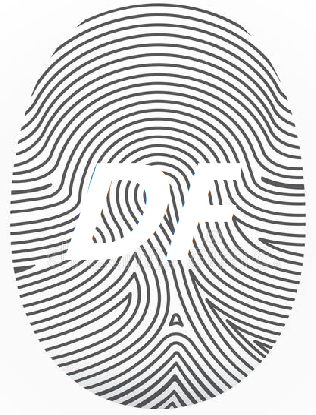

# deepfake-o-meter



This repository is a python library, which incorperates existing deepfake detection method into an unified framework.

## Introduction
To date, this toolbox supports following methods:

| Methods     | Platform            | Required Packages | Models  | 
|----------   |:-------------:      |:------:            |:------: | 
| XceptionNet |  py3, pytorch-1.0.1 | pretrainmodels | c23, c40, raw | 
| MesoNet     |  py3, keras-2.1.5, tf-1.5 |   -   | meso4,mesoinception4 |
| VA          |  py3                | - | svm | 
| ClassNSeg   |  py3, pytorch-1.0.1 | - | decoder-encoder | 
| CapsuleNet  |  py3, pytorch-1.0.1 | - | capsuleNet | 
| FWA         |  py2, tf-1.5        | - | resnet | 
| DSPFWA      |  py3, pytorch-1.0.1 | - | resnet50 | 
| Upconv      |  py3                | - | SVM | 
| WM          |  py3, pytorch-1.1.0 | - | efficientnet_b3, XceptionNet | 
| SelimSefer  |  py3, pytorch-1.1.0 | - | efficientnet_b7 |
| CNNDetection|  py3, pytorch-1.1.0 | - | resnet50 | 


## Quick Start

1. The original method (with slight modification for intergration) can be downloaded from [here]() shown in above table. Unzip the method to folder `externals`. You may need to make a new folder following below structure.

   ```
   Root --- deepfor ----- externals
         |- demo.py    |- methods
         |- ...        |- ...
         
   ```

2. `demo.py` is a demo script that shows how to run different methods. In our implementation, each method corresponds to a class, eg, `ClassNSeg()`. 
   ```python
   import deepfor, cv2
 
   # Read image
   img = cv2.imread('test_img.png')
   conf = deepfor.ClassNSeg().run(img) # conf of fake
   print('Fake confidence score is: {}'.format(conf))

   ```
   The class name of each method can be found in `demo.py`

3. Since different methods usually need different environment, we provides docker images for each method to save time. Following is an example of setting up environment.

   ```bash
   # Build docker enironment from docker image, eg,
   docker build -t classnseg ./dockerfile/ClassNSeg/
   ```


   Then run the demo code:

   ```bash
   docker run --runtime=nvidia -e NVIDIA_VISIBLE_DEVICES=0 -v /home/.../deepfake-o-meter:/deepfake-o-meter/ classnseg python deepfake-o-meter/demo.py --img=/deepfake-o-meter/test_img.png  --name=ClassNSeg

   docker run --gpus all -e NVIDIA_VISIBLE_DEVICES=0 -v /home/.../deepfake-o-meter:/deepfake-o-meter/ classnseg python deepfake-o-meter/demo.py --img=/deepfake-o-meter/test_img.png  --name=ClassNSeg
   ```

## Logs
* [4/13/2020] The first stage is all set, where seven methods are included.

## Comming Soon
We will employ docker to handle platform issue of each method.

## Citation

Please cite our paper in your publications if this toolbox is used in your research:

```
@inproceedings{Celeb_DF_cvpr20,
   author = {Yuezun Li, Xin Yang, Pu Sun, Honggang Qi and Siwei Lyu},
   title = {Celeb-DF: A Large-scale Challenging Dataset for DeepFake Forensics},
   booktitle= {IEEE Conference on Computer Vision and Patten Recognition (CVPR)},
   year = {2020}
}
```

## To whom may be interested in incorperating their methods into this toolbox

If you are interested in incorperating your method into this toolbox, please provide interface functions in a python file as follows:

````
# For instance, the interface file is called utils.py, which should contain four functions

def init_model(*args); # This is for initializing the network
def crop_face(*args); # Crop the faces from input image
def preproc(*args); # Any pre-processing operation on cropped faces, eg, normalization
def predict(*args); # Predictions of your method by taking the processed face as input
````
With these interfaces, we can intergrate your method more conviniently.

## GUI
We also provide a GUI interface for users. The detail of usage procedure is shown [here]().

## Contributors
* [Yuezun Li](https://www.albany.edu/~yl149995/)
* Cong Zhang
* Pu Sun 
* Ming-ching Chang
* Siwei Lyu


### Reference

<sup>
CapsuleNet: Nguyen, et al. Use of a Capsule Network to Detect Fake Images and Videos.[J]. arXiv, 2019. 

ClassNSeg: Nguyen, et al. "Multi-task learning for detecting and segmenting manipulated facial images and videos." arXiv, 2019. 

DSP-FWA: Li, etal. [Github](https://github.com/danmohaha/DSP-FWA)

FWA: Li, etal. "Exposing deepfake videos by detecting face warping artifacts." CVPRW, 2019.

MesoNet: Yang, etal. "Exposing deep fakes using inconsistent head poses." ICASSP, 2019.

Upconv: Durall, etal. "Watch your Up-Convolution: CNN Based Generative Deep Neural Networks are Failing to Reproduce Spectral Distributions." CVPR, 2020. 

VA: Matern, etal. "Exploiting visual artifacts to expose deepfakes and face manipulations." WACVW, 2019.

XceptionNet: Rossler, et al. "Faceforensics++: Learning to detect manipulated facial images." ICCV. 2019. 

CNNDetection: Wang, et al. CNN-generated images are surprisingly easy to spot... for now.[J]. arXiv, 2019. 

Selim: 1st of the DFDC competition [Github](https://github.com/selimsef/dfdc_deepfake_challenge)

WM: 2nd of the DFDC competition [Github](https://github.com/cuihaoleo/kaggle-dfdc)

</sup>