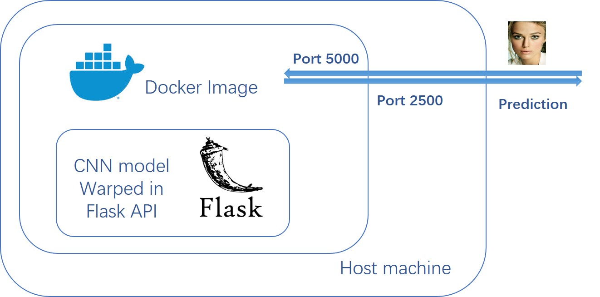

# Docker Introduction

## Introduction

We built a client-server model for the prediction of deepfake image. The docker image is used to create a deep learning environment. Models will keep running in the docker environment, waiting for images.  The connection between the docker image and the outside is through a specific port mapping between the docker image and the host machine. Once the images are send to the port of docker, the probability of deepfake will be calculated and return back.



## Installation

1. Install Docker

   Run the shell scrip for Docker installation. Chose one command based on different sources(Docker,  Alibaba Cloud, DaoCloud)

```shell
   curl -sSL https://get.docker.com/ | sh
```

```shell
   curl -sSL http://acs-public-mirror.oss-cn-hangzhou.aliyuncs.com/docker-engine/internet | sh -
```

```shell
   curl -sSL https://get.daocloud.io/docker | sh
```

2. Add user to docker group (logout required)
```shell
sudo usermod -aG docker your-username
```

2. Install Nvidia Docker2

```shell
# If you have nvidia-docker 1.0 installed: we need to remove it and all existing GPU containers
docker volume ls -q -f driver=nvidia-docker | xargs -r -I{} -n1 docker ps -q -a -f volume={} | xargs -r docker rm -f

sudo apt-get purge -y nvidia-docker
# Add the package repositories
curl -s -L https://nvidia.github.io/nvidia-docker/gpgkey | sudo apt-key add -
curl -s -L https://nvidia.github.io/nvidia-docker/ubuntu16.04/amd64/nvidia-docker.list | sudo tee /etc/apt/sources.list.d/nvidia-docker.list
# Install nvidia-docker2 and reload the Docker daemon configuration 
sudo apt-get update && sudo apt-get install -y nvidia-docker2
sudo pkill -SIGHUP dockerd
# Test nvidia-smi with the latest official CUDA image
docker run --gpus all --rm nvidia/cuda:9.0-base nvidia-smi
```

##  Create container and save an image

1. Create a container based on the image on [dockerhub](https://hub.docker.com/r/nvidia/cuda/tags). For GPU environment, we can use the images provided by Nvidia.


```shell
   docker run -it --name DLenv -v /lcoal/path/to/deepforensics/:/deepforensics/  --gpus all -e NVIDIA_VISIBLE_DEVICE=all nvidia/cuda:8.0-cudnn5-devel-ubuntu16.04
```

2. Set up environment.

```shell
   apt-get update
   apt-get upgrade
   apt install build-essential -y
   apt-get install python3 python3-pip cmake wget libglib2.0 libsm6 libxext6 libxrender-dev
   apt-get install software-properties-common
```

3. Install the packages for the deep learning model.

```shell
   pip install flask
   ...
```

4. Commit the container as a docker and push it to dockerhub.

```shell
   docker commit -a "UsrName" -m "environment creation" DLenv ImageName
   docker push UsrName:ImageName (if submitting to dockerhub)
```

5. Common command of docker please check [here](https://towardsdatascience.com/15-docker-commands-you-should-know-970ea5203421) and [here](https://www.digitalocean.com/community/tutorials/how-to-remove-docker-images-containers-and-volumes)

##  Test image

1. Create a server.py to start the server side.

```python
   import sys, os
   sys.path.append(os.path.dirname(__file__) + '/../')
   import pickle, cv2, deepfor
   import numpy as np
   from flask import Flask, request, jsonify

   app = Flask(__name__)
   model = deepfor.DSPFWA()

   @app.route('/deepforensics', methods=['POST'])
   def predict():
       # Get the data from the POST request.
       data = request.get_json(force = True)
       conf = model.run(np.array(data['feature']).astype(np.uint8)) # conf of fake
       return jsonify(conf.tolist())

   if __name__ == '__main__':
       app.run(debug = True, host = '0.0.0.0')
```

2. Load the image to the docker environment and set up port mapping of server machine with docker.

```
   docker run -p 2500:5000 -v /local/path/deepforensics/:/deepforensics/ --gpus all -e NVIDIA_VISIBLE_DEVICE=0 image_name python3 deepforensics/server/server_dspfwa.py
```

3. Test images.

   The connection between the port 5000 of the docker environment and the port 2500 of the host machine is built. We can vist the model loaded in the docker environment by sending images to the port 2500 of the host machine.

```python
   img = cv2.imread(img_path+imname)
   score = requests.post('http://server_ip:2500/deepforensics', json={'feature': img.tolist()})
```